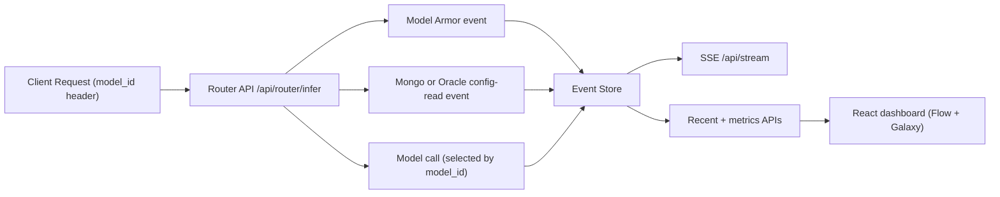

# LLM Observability Dashboard

Real-time observability dashboard for LLM traffic with:
- animated ingress/config/egress flow
- model galaxy view for high model counts
- rolling model health/risk scoring
- alerting (sound + threshold)
- recent requests grid with filtering, search, pagination, and time range controls

Backend: FastAPI + SSE (+ optional Kafka consumer)  
Frontend: React + Vite

## Production Docs

- Trace Explorer configuration guide: [`docs/TRACE_EXPLORER_CONFIGURATION.md`](docs/TRACE_EXPLORER_CONFIGURATION.md)

## Architecture



## Event Schema

```json
{
  "request_id": "uuid",
  "timestamp": "2026-02-28T08:10:00Z",
  "user_id": "alice",
  "model_id": "gpt-4.1",
  "tenant_id": "tenant-a",
  "provider": "openai",
  "region": "us-east-1",
  "service": "router",
  "status": "success",
  "status_code": 200,
  "input_tokens": 410,
  "output_tokens": 175,
  "latency_ms": 260,
  "cost_usd": 0.0059,
  "error": null
}
```

## Backend (FastAPI)

Path: `/Users/manas/work/aiml/codex/observability/backend`

### Endpoints

- `GET /health`
- `POST /api/events`  
  Ingest a telemetry event.
- `POST /api/router/infer`  
  Reference router endpoint. Reads `model_id` header, emits `armor` + `mongo/oracle` + `router` events.
- `GET /api/stream`  
  SSE stream. Supports query filters: `user_id`, `model_id`, `service`, `status`.
- `GET /api/events/recent?limit=120`
- `GET /api/summary`
- `GET /api/models/catalog`  
  Returns model/provider/region catalog for UI (used by Flow/Galaxy; no hardcoded frontend model list needed).
- `GET /api/models/metrics`  
  Rolling model metrics + risk.

### OpenTelemetry (production tracing)

Backend now includes OpenTelemetry SDK + FastAPI instrumentation:
- auto-instruments inbound HTTP requests
- propagates trace context into worker threads for `config_read`
- records thread exceptions on spans and in telemetry details

Config (`backend/.env`):
- `OTEL_ENABLED=true`
- `OTEL_SERVICE_NAME=llm-observability-api`
- `OTEL_EXPORTER_OTLP_ENDPOINT=http://localhost:4318/v1/traces` (optional)

If OTLP endpoint is set, spans are exported using OTLP HTTP.

### Non-blocking ingestion + durable history

Telemetry ingestion is now queue-based:
- request path publishes events with non-blocking enqueue (`publish_event`)
- background dispatcher persists events to durable SQLite and updates SSE in-memory cache

Durable history store:
- SQLite path (configurable): `TELEMETRY_DB_PATH` (default `backend/data/telemetry_history.db`)
- APIs (`/api/events/recent`, traces, summary, metrics) read from durable history

Queue config:
- `TELEMETRY_QUEUE_SIZE` (default `10000`)

Current mock catalog (routable via `/api/router/infer`) includes families from:
- OpenAI: `gpt-4.1`, `gpt-4o-mini`, `gpt-4.5`, `o3-mini`, `o4-mini`
- Anthropic: `claude-sonnet`, `claude-opus`, `claude-haiku`
- Google: `gemini-2.5-pro`, `gemini-2.5-flash`, `gemini-1.5-pro`, `gemini-1.5-flash`
- Meta: `llama-3.3`, `llama-3.1-70b`, `llama-3.1-8b`
- Mistral: `mistral-large`, `mixtral-8x7b`
- Deepseek: `deepseek-r1`, `deepseek-v3`
- Alibaba: `qwen-2.5-72b`, `qwen-2.5-32b`
- Cohere: `cohere-command-r`, `cohere-command-r-plus`
- On-prem: `onprem-coder-14b`, `onprem-reasoner-32b`

### Metrics Query Parameters

`/api/models/metrics` supports:
- window: `window_seconds`
- filters: `usecase_id`, `request_id`, `model_id`, `service`, `status`, `provider`, `tenant_id`, `time_from`, `time_to`
- SLO caps: `latency_slo_ms`, `token_slo_tps`
- health thresholds: `warm_threshold`, `degrading_threshold`, `critical_threshold`

### Risk Model

Per model:
- `token_rate_tps = (input_tokens + output_tokens) / window_seconds`
- `normalized_token_rate = min(1, token_rate_tps / token_slo_tps)`
- `normalized_p95_latency = min(1, p95_latency_ms / latency_slo_ms)`
- `risk_score = min(1, 0.5*failure_rate + 0.3*normalized_p95_latency + 0.2*normalized_token_rate)`

Color bands:
- Healthy: `< warm_threshold`
- Warm: `>= warm_threshold and < degrading_threshold`
- Degrading: `>= degrading_threshold and < critical_threshold`
- Critical: `>= critical_threshold`

## Frontend (React + Vite)

Path: `/Users/manas/work/aiml/codex/observability/frontend`

### Features

- Flow mode: per-request motion dots only when events exist.
- Galaxy mode: provider clusters + others bucket.
- Gear settings:
  - Sound on/off
  - Test sound
  - Tone
  - Tone pause seconds
  - SLO latency/token caps
  - Health thresholds (warm/degrading/critical)
  - Optional side panels + model name visibility
- Risk info popover with formula details.

### Important behavior

Recent Requests filters are propagated to model metrics API calls, so dashboard health/risk reflects the currently filtered scope (model/usecase/service/status/time window).

## Run

### Backend

```bash
cd backend
python -m venv .venv
source .venv/bin/activate
pip install -r requirements.txt
uvicorn app.main:app --reload --port 8000 --timeout-graceful-shutdown 2
```

### Frontend

```bash
cd frontend
npm install
npm run dev
```

Optional frontend env:

```bash
VITE_API_BASE=http://localhost:8000
```

## Quick test request

```bash
curl -X POST "http://localhost:8000/api/router/infer" \
  -H "content-type: application/json" \
  -H "model_id: gpt-4.1" \
  -d '{
    "usecase_id": "claims-pricing",
    "tenant_id": "tenant-a",
    "prompt": "Refactor this Python function",
    "use_oracle": false
  }'
```

## Python 3.14 note

- `aiokafka` is skipped on Python 3.14 by environment marker.
- Keep `KAFKA_ENABLED=false` on 3.14 for this starter, or run backend on Python 3.12/3.13 for Kafka consumer mode.
